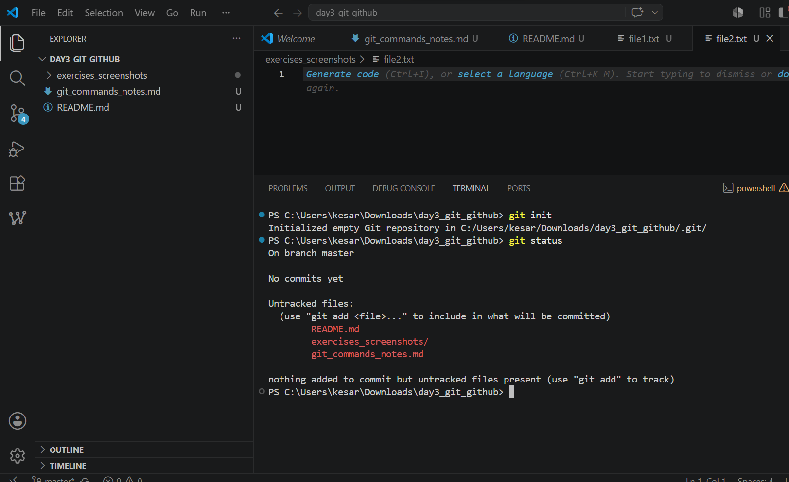
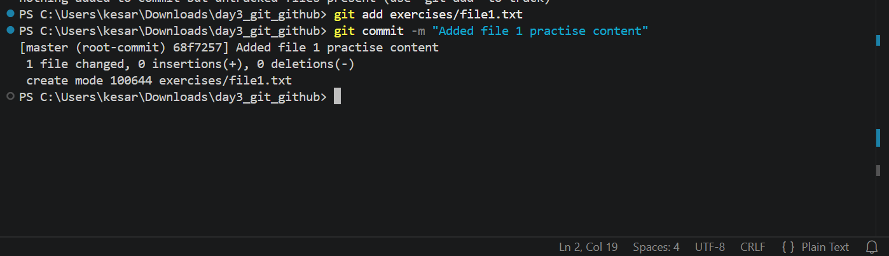
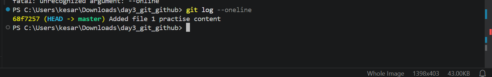

# Day 3 - Git & GitHub Professional Workflow

This repository contains Day 3 practice work focused on Git and GitHub workflow.

## Topics Practiced
- Git basics: `git init`, `git status`, `git add`, `git commit`, `git log`
- Branching with `git checkout -b`
- Merge conflict creation and resolution
- Pushing code to GitHub
- Organizing project files in a clean repository structure

## Repository Structure
```text
day3_git_github/
├── exercises/
│   ├── file1.txt
│   └── file2.txt
├── screenshots/
├── git_commands_notes.md
└── README.md
```

## Files in This Repository
- `exercises/file1.txt` - Basic Git practice file
- `exercises/file2.txt` - Branching and merge conflict practice file
- `git_commands_notes.md` - Notes for important Git commands and concepts
- `screenshots/` - Screenshots showing the practice steps and workflow

## What Was Done
1. Initialized a local Git repository.
2. Added and committed practice files.
3. Created a feature branch.
4. Made different changes in `master` and the feature branch.
5. Created a merge conflict intentionally.
6. Resolved the merge conflict manually.
7. Committed the resolved version.
8. Pushed the repository to GitHub.

## Learning Outcome
This practice helped build understanding of:
- How Git tracks changes.
- How branches help isolate work safely.
- How merge conflicts happen and how to solve them.
- How GitHub is used to store and manage project history.
- How to maintain a clean and organized repository.

## Collaborative Workflow
A simple collaborative workflow followed in this project:
1. Create a branch for new work.
2. Make changes and commit them.
3. Merge the branch back into the main branch.
4. Resolve conflicts when the same file is changed in multiple branches.
5. Push the final code to GitHub.

# Screenshots of the work
## Screenshots




